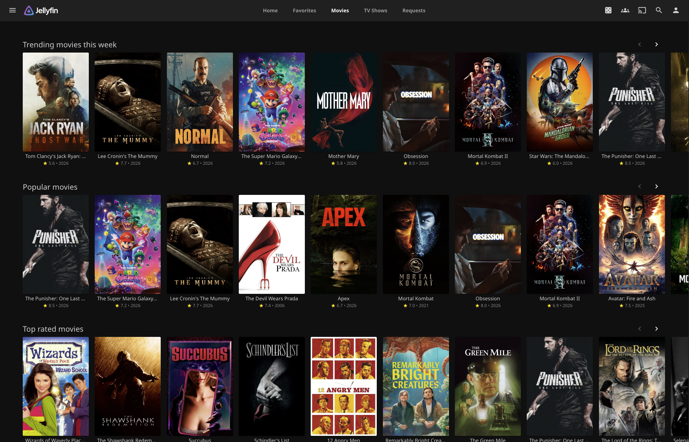

<div align="center">

<div alt style="text-align: center; transform: scale(.25);">
	<picture>
		<source media="(prefers-color-scheme: dark)" srcset="https://github.com/varunaditya-plus/BetterSeerrTabs/raw/main/assets/logo_dark.png" />
		
	</picture>
</div>

# BetterSeerrTabs


[](https://github.com/varunaditya-plus/BetterSeerrTabs/releases/latest)

The best way to discover and request Movies and TV Shows by using Seerr directly in Jellyfin. This plugin lets you add two top bar tabs for Movies and TV discovery, with request modals powered by your Jellyseerr instance. The categories are gotten using TMDB.

</div>



---

## Features
- **Add**: A bunch of really
- **cool**: features when I
- **have**: a bunch of time


## Installation

### First make sure you have these prerequisites:
- A running Jellyfin **10.11.x** and Seerr (or Jellyseerr) instance
- [File Transformation](https://www.iamparadox.dev/jellyfin/plugins/manifest.json) plugin
- [Custom Tabs](https://www.iamparadox.dev/jellyfin/plugins/manifest.json) plugin

### Install from plugin catalog
1. Open **Dashboard → Plugins → Manage Repositories**.
2. Click **New Repository** and paste this repository URL:
```
https://raw.githubusercontent.com/varunaditya-plus/BetterSeerrTabs/main/manifest.json
```
3. Now go back to **Plugins** in the sidebar, select **All** in the filters above the plugins, and click BetterSeerrTabs. Then click **Install**.
4. Now you have to restart your Jellyfin instance. Go to **Dashboard** and click the **Restart** button. You're done!

### Configuration
After installation, now configure the extension so it will work with your Seerr instance. Go to **Dashboard → Plugins → BetterSeerrTabs**, click settings, and follow the instructions. You're not stupid. You figured out how to get Jellyfin and Jellyseerr installed.

## Compatibility
| Jellyfin version | Status |
|---|---|
| 10.11.x | Tested |
| 10.10.x | Should work |
| Earlier | Untested |

## Contributing & Support
Please open pull requests if you have any suggestions or features you want to be implemented in this plugin. This is my first C# project, and is inspired heavily by [Home Screen Sections](https://github.com/IAmParadox27/jellyfin-plugin-home-sections). For suggestions, feature requests, or bug reports, open an issue. Please include your Jellyfin version and a screenshot if relevant.

## License
BetterSeerrTabs is licensed under the [Undecided License](https://github.com/).

## Credits
- [Lato](https://fonts.google.com/specimen/Lato) by Łukasz Dziedzic, served via Google Fonts.
- Movie and TV metadata, images, and the TMDB logo from [The Movie Database (TMDB)](https://www.themoviedb.org/).
- Discover and request flows powered by the [Seerr](https://github.com/seerr-team/seerr) API.
- Uses [File Transformation](https://github.com/IAmParadox27/jellyfin-plugin-file-transformation) and depends on [Custom Tabs](https://github.com/IAmParadox27/jellyfin-plugin-custom-tabs) by IAmParadox27.